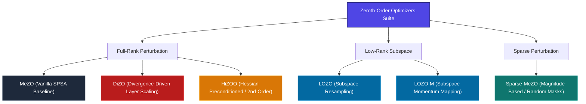

# 🌟 OptML Zero: Zeroth-Order Optimization Suite Status

Welcome to the **OptML Zero** optimization suite dashboard. This repository hosts a state-of-the-art, memory-efficient distributed pipeline designed to benchmark and fine-tune Large Language Models (LLMs) using cutting-edge **Zeroth-Order (ZO) optimizers**. By bypassing standard backpropagation and gradient calculation, these methods achieve near-inference memory usage, enabling full-parameter fine-tuning on consumer-grade hardware or dense multi-GPU HPC environments.

Below is the definitive status of our active optimization models, architectural structures, and available runtime configurations.

---

## 🚀 The Zeroth-Order Optimizer Suite

We have successfully implemented and integrated **six custom zeroth-order optimization algorithms** under the [optimizers/](file:///c:/Users/34644/Desktop/OptML_zero/optimizers) module. The table below outlines their theoretical foundations, key architectural strategies, and unique advantages:

| Optimizer | Paper / Origin | Perturbation Strategy | Key Feature / Memory Footprint | File |
| :--- | :--- | :--- | :--- | :--- |
| **MeZO** | *Malladi et al., NeurIPS 2023* (arXiv:2305.17333) | Full-Rank SPSA $\theta \pm \epsilon z$ where $z \sim \mathcal{N}(0, I)$ | Baseline zeroth-order; memory matches inference by using deterministic per-parameter seeds. | [mezo.py](file:///c:/Users/34644/Desktop/OptML_zero/optimizers/mezo.py) |
| **LOZO** | *Chen et al., ICLR 2025* (arXiv:2410.07698) | Low-Rank Subspace $X + \epsilon U V^T$ where $V \in \mathbb{R}^{d \times r}$ | Restricts perturbations to a lower-rank subspace. Resamples $V$ every $\nu$ steps to explore parameter spaces efficiently. | [lozo.py](file:///c:/Users/34644/Desktop/OptML_zero/optimizers/lozo.py) |
| **LOZO-M** | *Chen et al., ICLR 2025* (arXiv:2410.07698) | Low-Rank Subspace with Momentum | Introduces a subspace-projected momentum tracking vector $N_l$ that rescales mathematically across subspace resampling to prevent momentum collapse. | [lozo.py](file:///c:/Users/34644/Desktop/OptML_zero/optimizers/lozo.py) |
| **Sparse-MeZO**| *Liu et al., 2024* | Sparse Masked Perturbation $X \pm \epsilon (Z \odot M)$ | Perturbs only a subset of parameter entries per step. Supports `small_magnitude`, `large_magnitude`, and `random` masks. | [sparse_mezo.py](file:///c:/Users/34644/Desktop/OptML_zero/optimizers/sparse_mezo.py) |
| **DiZO** | *Harmony in Divergence, NeurIPS 2025* (arXiv:2502.03304) | Two-Phase Full-Rank + Projection Rescaling | Periodically (every $\kappa$ steps) optimizes a per-layer scalar ratio $\alpha_l = \gamma_l / \|\delta_l\|$ on $Q/V$ attention layers to align ZO updates with first-order gradient magnitudes. | [dizo.py](file:///c:/Users/34644/Desktop/OptML_zero/optimizers/dizo.py) |
| **HiZOO** | *Zhao et al., NeurIPS 2024* (arXiv:2402.15173) | Hessian-Preconditioned SPSA $\theta \pm \epsilon \sqrt{\Sigma} u$ | Dynamically tracks a moving average of the diagonal Hessian $\Sigma_l$ to precondition the parameter perturbations, enabling second-order ZO updates. | [hizoo.py](file:///c:/Users/34644/Desktop/OptML_zero/optimizers/hizoo.py) |

---

## 📊 Optimizer Taxonomy

The flowchart below visualizes how the different Zeroth-Order optimizers in our suite diverge in their mathematical structure and parameter projection techniques:

---

## 🛠️ Repository Architecture & Entrypoints

Our codebase is split into two specialized sub-environments depending on the target task style:

### 1. Unified Causal Language Modeling Pipeline (Root Directory `/`)
Designed to fine-tune autoregressive models (e.g., **Qwen3.5-0.8B** or **OPT-1.3B**) on generative/classification datasets (e.g., **PolyAI/banking77** conversational format) using distributed multi-GPU clusters via Hugging Face `accelerate`.

*   **Main script:** [train.py](file:///c:/Users/34644/Desktop/OptML_zero/train.py) (includes dynamic formatting, token masking for conversational prompts, token-based boundary termination, and automatic preemptive checkpoint resume via HF Hub snapshot download).
*   **Active configurations & shell runners:**
    *   **LOZO / LOZO-M:** Configured in [config.yaml](file:///c:/Users/34644/Desktop/OptML_zero/config.yaml) ➔ Executed via [run_lozo.sh](file:///c:/Users/34644/Desktop/OptML_zero/run_lozo.sh) & [submit_lozo.sh](file:///c:/Users/34644/Desktop/OptML_zero/submit_lozo.sh)
    *   **DiZO:** Configured in [config_dizo.yaml](file:///c:/Users/34644/Desktop/OptML_zero/config_dizo.yaml) ➔ Executed via [run_dizo.sh](file:///c:/Users/34644/Desktop/OptML_zero/run_dizo.sh) & [submit_dizo.sh](file:///c:/Users/34644/Desktop/OptML_zero/submit_dizo.sh)
    *   **HiZOO:** Configured in [config_hizoo_smoke.yaml](file:///c:/Users/34644/Desktop/OptML_zero/config_hizoo_smoke.yaml) ➔ Executed via [run_hizoo_smoke.sh](file:///c:/Users/34644/Desktop/OptML_zero/run_hizoo_smoke.sh)
    *   **Sparse-MeZO:** Configured in [config_sparse_mezo.yaml](file:///c:/Users/34644/Desktop/OptML_zero/config_sparse_mezo.yaml) ➔ Executed via [run_sparse_mezo.sh](file:///c:/Users/34644/Desktop/OptML_zero/run_sparse_mezo.sh)
    *   **MeZO:** Configured in [config_mezo_smoke.yaml](file:///c:/Users/34644/Desktop/OptML_zero/config_mezo_smoke.yaml) ➔ Executed via [run_mezo_smoke.sh](file:///c:/Users/34644/Desktop/OptML_zero/run_mezo_smoke.sh)
    *   **First-Order Baseline (AdamW):** Configured in [config_adam.yaml](file:///c:/Users/34644/Desktop/OptML_zero/config_adam.yaml) (switches back to standard backpropagation automatically).

### 2. Sequence Classification Suite (`/classificationhead/`)
Specifically structured to train models using explicit classification heads (e.g. RoBERTa architectures) where a classification layer is appended to the model output.

*   **Main script:** [classificationhead/train.py](file:///c:/Users/34644/Desktop/OptML_zero/classificationhead/train.py) (manages custom sequence classification tokens, dataset loading, and metrics tracking).
*   **Active configurations & shell runners:**
    *   **LOZO / LOZO-M:** Configured in [classificationhead/config.yaml](file:///c:/Users/34644/Desktop/OptML_zero/classificationhead/config.yaml) ➔ Executed via [classificationhead/run_lozo.sh](file:///c:/Users/34644/Desktop/OptML_zero/classificationhead/run_lozo.sh) & [classificationhead/submit_lozo.sh](file:///c:/Users/34644/Desktop/OptML_zero/classificationhead/submit_lozo.sh)
    *   **First-Order Baseline (AdamW):** Configured in [classificationhead/config_adam.yaml](file:///c:/Users/34644/Desktop/OptML_zero/classificationhead/config_adam.yaml).

---

> [!TIP]
> **Deterministic Random Seed Synchronization**
>
> All of our zeroth-order optimizers use a stable parameter ID injection mechanism (`p.param_id = i`) implemented in the main `train.py` loop. This assigns a unique, immutable index to every model weight, ensuring that the pseudo-random generators (`torch.Generator`) remain perfectly synchronized across multi-GPU distributed nodes (using Hugging Face `accelerate`). This prevents **DDP drift** and guarantees mathematically correct global gradient estimation.

> [!IMPORTANT]
> **Memory & Training Efficiency**
>
> When using any of the Zeroth-Order optimizers, `train.py` automatically puts the model in `model.eval()` mode during training steps. This disables stochastic layers (like Dropout) to ensure that the forward passes ($L_+$ and $L_-$) are evaluated on identical network configurations, preserving the integrity of the finite-difference gradient estimation.
